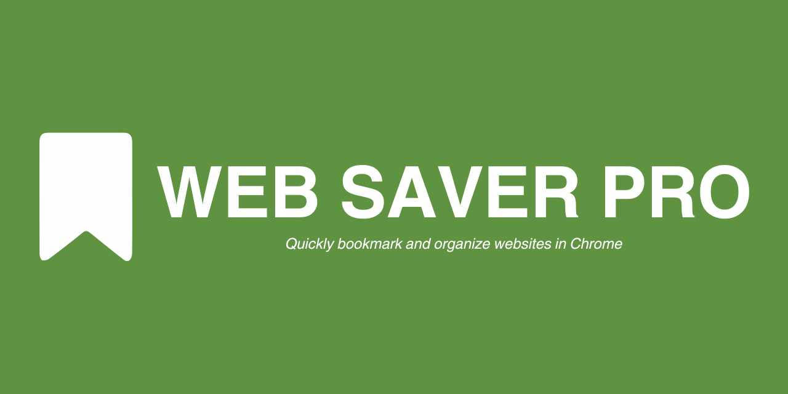
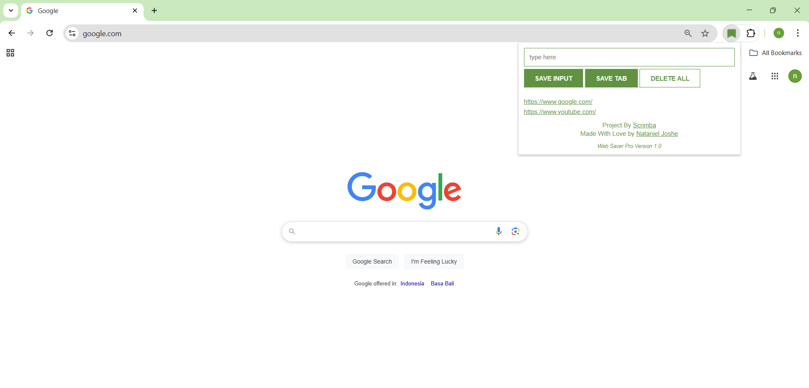

# Web Saver Pro



### _Chrome Extension to Organize Website Links_

---

This is a clone project of chrome extension leads tracker by [Scrimba](https://scrimba.com/home)

### Preview

---



### How To Install

---

1. Clone Repo or Download Zip
2. Enable **Developer mode** at chrome://extensions/.
3. Click **Load unpacked** and select the downloaded folder.
4. Enjoy Web Saver Pro! 🥳

### The Process

---

Through this project, I learned several new things:

- chrome.tabs.query to collect current user tab links

```js
tabBtn.addEventListener("click", function () {
  //grab the URL of the current tab
  chrome.tabs.query({ active: true, currentWindow: true }, function (tabs) {
    myLinks.push(tabs[0].url);
    localStorage.setItem("myLinks", JSON.stringify(myLinks));
    renderLinks(myLinks);
  });
});
```

- manipulating string and using the template string to give a proper link when it saved

```js
function renderLinks(links) {
  let linksItems = "";
  for (let i = 0; i < links.length; i++) {
    // Ensure the link starts with "https://" if not already present
    let link = links[i].startsWith("http") ? links[i] : `https://${links[i]}`;

    linksItems += `
      <li> 
          <a target='_blank' href='${link}'>
          ${links[i]}
          </a> 
      </li>
      `;
  }
  ulEl.innerHTML = linksItems;
}
```

- Using manifest.json to provide some related information for the browser

```json
{
  "manifest_version": 3,
  "version": "1.0",
  "name": "Web Saver Pro",
  "action": {
    "default_popup": "index.html",
    "default_icon": "./images/bookmark-solid.png"
  },
  "permissions": ["tabs"]
}
```

#### New Feature

---

I added new features and modified some codes. Some of them are:

- Button changes when hovering over the button
- Adding "https" automatically to help users mark links
- And other minor changes, such as size, color, and text

### Acknowledgement

---

Thanks to scrimba.com for helping people learn programming!
